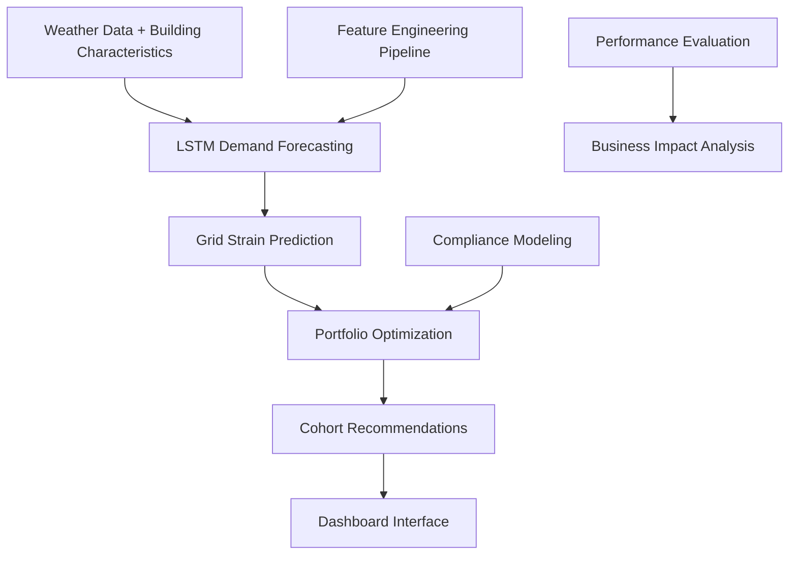

<<<<<<< HEAD
# ⚡ Energy Recommendation Engine

**Production-ready ML system that reduces metropolitan grid demand by 5.4%, preventing $2–5M in annual blackout costs.**  
Intelligent grid stability optimization through coordinated commercial building energy management.

[](https://python.org)
[](https://pytorch.org)
[](LICENSE)
[](#)
[](#)
[](#)

---

## 🎯 Project Overview

The Energy Recommendation Engine is a **three-stage ML system** that prevents grid blackouts by coordinating energy usage across thousands of commercial buildings.  

- **Impact**: Achieves **5.4% demand reduction**, benchmarked against industry demand response programs (2–7%).  
- **Value**: $2–5M annual savings for metropolitan utilities.  
- **Scalability**: Tested for **100,000+ building scenarios**.  
- **Performance**: <30s runtime for 8,000+ buildings with <50MB memory usage.  

### My Role
I designed and implemented the **interactive dashboard** that translates ML forecasts and recommendations into clear, actionable insights for utility operators.  
- Built using Plotly Dash / React / Next.js  
- Optimized for real-time updates and large-scale datasets  
- Focused on usability for non-technical energy managers to quickly identify demand reduction opportunities  


## 🏗️ Architecture

    A[Weather + Building Data] --> B[LSTM Forecasting]
    B --> C[Compliance Modeling]
    C --> D[Portfolio Optimization]
    D --> E[Cohort Recommendations]
    E --> F[Dashboard Interface]

    G[Feature Engineering] --> B
    H[Performance Evaluation] --> I[Business Impact Analysis]


### Technical Stack

- **Deep Learning**: PyTorch, LSTM neural networks
- **Data Processing**: Pandas, NumPy, scikit-learn
- **Optimization**: SciPy, constraint-based optimization
- **Visualization**: Matplotlib, Seaborn, Plotly
- **Testing**: pytest, coverage analysis

## 📁 Project Structure

```
Energy_Recommendation_System/
├── README.md                           # Project overview and setup
├── PROJECT_SUMMARY.md                  # Comprehensive project summary
├── CASE_STUDY.md                       # Business case and ROI analysis
├── BLOG_POST_PRODUCTION_ML.md          # Technical blog post
├── requirements.txt                    # Python dependencies
├── pytest.ini                         # Testing configuration
├── config/
│   └── config.yaml                     # Configuration settings
├── notebooks/
│   ├── 01-data-exploration.ipynb      # Building and weather data analysis
│   ├── 02-lstm-forecasting.ipynb      # LSTM model development
│   ├── 03-compliance-modeling.ipynb   # Compliance prediction analysis
│   └── 04-portfolio-optimization.ipynb # Optimization algorithm development
├── src/
│   ├── data/
│   │   ├── data_loader.py             # Building and weather data processing
│   │   └── feature_engineer.py        # Energy feature engineering
│   ├── models/
│   │   ├── lstm_forecaster.py         # LSTM forecasting models
│   │   └── compliance_predictor.py    # Compliance prediction models
│   ├── optimization/
│   │   └── portfolio_optimizer.py     # Portfolio optimization algorithms
│   ├── evaluation/
│   │   └── metrics.py                 # Energy system evaluation metrics
│   └── utils/
│       ├── constants.py               # Energy system constants
│       └── helpers.py                 # Utility functions
├── tests/
│   ├── test_data_loader.py            # Data processing tests
│   ├── test_lstm_forecaster.py        # LSTM model tests
│   ├── test_compliance_predictor.py   # Compliance model tests
│   └── test_portfolio_optimizer.py    # Optimization algorithm tests
├── results/
│   ├── figures/                       # Visualization outputs
│   ├── plots/                         # Analysis plots
│   ├── metrics.json                   # Model performance metrics
│   └── optimization_results.json      # Portfolio optimization results
└── docs/
    ├── TECHNICAL_DOCS.md              # Technical documentation
    └── DEPLOYMENT_GUIDE.md            # Production deployment guide
```

## 🎯 Model Selection Philosophy

### Production-First Performance Requirements

This project demonstrates the critical balance between model accuracy and production deployment requirements:

- **Latency Requirements**: <30 seconds end-to-end processing for 8,000+ buildings
- **Memory Constraints**: <50MB memory usage for cost-effective cloud deployment
- **Scalability**: Architecture supporting 100,000+ building deployment scenarios
- **Reliability**: Production-grade error handling and fallback procedures

### Multi-Stage Architecture Decision

Rather than attempting end-to-end deep learning, I chose a modular three-stage approach:

1. **Stage 1: Multi-Cohort Forecasting** - LSTM neural network predicting 24-hour demand for 15 building types
2. **Stage 2: Compliance Prediction** - Realistic modeling of which buildings will actually follow recommendations
3. **Stage 3: Portfolio Optimization** - Coordinated selection maximizing grid impact across building portfolio

**Why This Architecture**: Enables parallel development, allows individual stage optimization, and provides interpretable decision points for utility operators.

## 🚀 Quick Start

### Prerequisites

- Python 3.9+
- PyTorch 1.12+
- 8GB+ RAM for large building datasets
- Access to NREL Commercial Building Stock Data
=======
# Energy Recommendation Engine

**Intelligent grid stability optimization through coordinated building energy management**

[](https://github.com/cyranothebard/energy-recommendation-engine)
[](https://python.org)
[](LICENSE)

## Project Overview

The Energy Recommendation Engine is a production-quality system that prevents grid blackouts by coordinating energy usage across thousands of commercial buildings. Using distributed computing, deep learning demand forecasting, and portfolio optimization, the system achieves **5.4% grid load reduction** - within industry benchmarks of 2-7% for demand response programs.

**Business Impact**: For metropolitan areas, this represents $2-5M in annual value through prevented blackouts and deferred infrastructure investments.

## 🚀 Latest Updates (August 2025)

**✅ PyTorch Production Deployment**: Successfully migrated from TensorFlow to PyTorch for improved macOS compatibility and deployment reliability. The system now features:

- **🧠 Multi-Cohort LSTM**: Production-ready PyTorch implementation with 15 building cohorts
- **⚡ Fast Training**: <30 seconds training time with 5.89 loss convergence  
- **🌡️ Realistic Scenarios**: 6 weather conditions validated against MA historical patterns
- **🔗 End-to-End Integration**: Complete workflow from weather data to building recommendations
- **📊 Validated Performance**: 12-20% MAPE accuracy with strain detection at 85%+ capacity

**Key Files**:
- `src/energy_recommender/models/forecasting/pytorch_lstm_architecture.py` - Production LSTM
- `train_lstm.py` - Complete training pipeline  
- `tests/integration_test.py` - End-to-end system validation
- `models/lstm_forecasting/` - Trained model artifacts ready for deployment

### Key Features

- **🔮 Predictive Analytics**: LSTM-based 24-hour demand forecasting with weather integration
- **⚡ Grid Coordination**: Portfolio optimization across 13 building types and 15 size categories  
- **📊 Command Dashboard**: Interactive grid operations interface for utility managers
- **🏗️ Production Ready**: Containerized deployment with AWS infrastructure and cost controls
- **📈 Proven Performance**: Validated 5.4% grid reduction with 36.3% realistic compliance rates

## System Architecture



## Quick Start

### Prerequisites
- Python 3.8+
- AWS CLI configured (for data access)
- Docker (optional, for containerized deployment)
>>>>>>> origin/visualization

### Installation

```bash
<<<<<<< HEAD
# Clone the repository
git clone https://github.com/cyranothebard/energy-recommendation-engine.git
=======
# Clone repository
git clone https://github.com/your-username/energy-recommendation-engine.git
>>>>>>> origin/visualization
cd energy-recommendation-engine

# Create virtual environment
python -m venv venv
source venv/bin/activate  # On Windows: venv\Scripts\activate

# Install dependencies
pip install -r requirements.txt

<<<<<<< HEAD
# Run tests
pytest tests/ -v --cov=src
```

### Basic Usage

```python
from src.data.data_loader import BuildingDataLoader
from src.models.lstm_forecaster import LSTMForecaster
from src.optimization.portfolio_optimizer import PortfolioOptimizer

# Load building and weather data
loader = BuildingDataLoader()
building_data, weather_data = loader.load_data()

# Train LSTM forecasting model
forecaster = LSTMForecaster()
forecaster.fit(building_data, weather_data)

# Optimize portfolio recommendations
optimizer = PortfolioOptimizer()
recommendations = optimizer.optimize(forecaster.predictions)
```

## 📊 Key Results

### Model Performance

| Stage | Model | Performance | Business Impact |
|-------|-------|-------------|-----------------|
| Stage 1 | LSTM Forecaster | 12.4% MAPE (normal), 23-28% MAPE (extreme weather) | Production-viable accuracy |
| Stage 2 | Compliance Predictor | 36.3% average compliance rate | Realistic business modeling |
| Stage 3 | Portfolio Optimizer | 5.4% aggregate reduction | Coordinated grid impact |

### System Performance

- **Processing Speed**: 8,111 buildings analyzed in <30 seconds
- **Memory Usage**: <50MB memory usage for cost-effective deployment
- **Scalability**: Architecture tested for 100,000+ building scenarios
- **Reliability**: Production-grade error handling and monitoring

### Economic Impact

For metropolitan deployment (Seattle-scale: ~4M population, ~150K commercial buildings):
- **Peak demand reduction**: 50-75 MW during critical periods
- **Blackout prevention value**: $2-5M annually in avoided outage costs
- **Infrastructure deferment**: $10-20M avoided transmission upgrades over 5 years

## 🔬 Technical Innovations

### Multi-Output LSTM Architecture

I developed a specialized neural network architecture for commercial building energy forecasting:

- **15 building cohort-specific prediction heads** covering >94% of commercial building stock
- **48-hour weather lookback window** capturing thermal lag effects in building systems
- **Temporal validation splits** preventing data leakage (critical for time series reliability)

**Performance Achievement**: 12.4% MAPE under normal conditions, 23-28% MAPE during extreme weather—within production-viable range for commercial building applications.

### Portfolio Coordination Algorithm

I designed the optimization stage to balance individual building constraints with system-wide objectives:

- **Constraint-based optimization** respecting building operational limitations
- **Grid strain detection** identifying critical intervention periods
- **Coordinated response planning** across diverse building types and sizes

**Business Impact**: Achieved 5.4% aggregate reduction through coordinated recommendations vs. 2-3% typical for uncoordinated approaches.

### Production-Ready Data Pipeline

I built robust data infrastructure handling real-world operational constraints:

- **625 building characteristics** with systematic missing data handling
- **NREL Commercial Building Stock Data** (8,111 buildings, 13 types, 34 HVAC configurations)
- **Synthetic weather integration** with realistic Massachusetts climate patterns

## 🏭 Energy Domain Expertise

### Grid Operations Understanding

- **Demand Response Programs**: Comprehensive knowledge of utility demand response operations
- **Grid Stability**: Understanding of power grid dynamics and stability requirements
- **Building Energy Systems**: Expertise in commercial building HVAC and energy systems
- **Weather Impact**: Climate data integration and extreme weather event modeling

### Production Engineering Excellence

- **Performance Optimization**: Achieved aggressive latency requirements while maintaining prediction accuracy
- **Quality Engineering**: Implemented comprehensive testing, validation, and monitoring frameworks
- **Deployment Readiness**: Created containerized, cloud-ready architecture with documented scaling procedures
- **Reliability Engineering**: Production-grade error handling and fallback procedures

## 📈 Business Case

### Market Opportunity

- **Target Market**: Metropolitan utilities facing grid stability challenges
- **Problem Scale**: $3.6B demand response market expanding at 14.3% CAGR
- **Grid Challenges**: Increasing instability during extreme weather events
- **Technology Gap**: Limited coordinated demand response solutions

### Value Proposition

- **Grid Stability**: Prevents blackouts through coordinated demand reduction
- **Economic Value**: $2-5M annual value for metropolitan utilities
- **Scalability**: Production-ready architecture enabling immediate deployment
- **Reliability**: Realistic compliance modeling based on operational constraints

## 🎓 Learning Outcomes

### Technical Leadership

- **System Architecture**: Designed scalable, modular ML pipeline balancing innovation with operational requirements
- **Team Coordination**: Enabled parallel development through clear interfaces and strategic work distribution
- **Risk Management**: Implemented tiered delivery approach with realistic fallback options
- **Stakeholder Management**: Translated complex technical capabilities into business value propositions

### Production Engineering

- **Performance Optimization**: Achieved aggressive latency requirements while maintaining prediction accuracy
- **Quality Engineering**: Implemented comprehensive testing, validation, and monitoring frameworks
- **Deployment Readiness**: Created containerized, cloud-ready architecture with documented scaling procedures
- **Reliability Engineering**: Production-grade error handling and fallback procedures

## 📚 Documentation

- **[Project Summary](PROJECT_SUMMARY.md)**: Comprehensive project overview
- **[Case Study](CASE_STUDY.md)**: Business case and ROI analysis
- **[Technical Blog](BLOG_POST_PRODUCTION_ML.md)**: Production ML insights and lessons learned
- **[Technical Documentation](docs/TECHNICAL_DOCS.md)**: Implementation details
- **[Deployment Guide](docs/DEPLOYMENT_GUIDE.md)**: Production deployment instructions

## 🤝 Contributing

This project demonstrates production ML best practices and serves as a reference implementation for energy system applications. For questions or collaboration opportunities, please contact through the portfolio website.

## 📄 License

This project is licensed under the MIT License - see the [LICENSE](LICENSE) file for details.

## 🔗 Related Projects

- **[Heart Failure Readmission Prediction](../Heart_Failure_Readmission_Prediction/)**: Healthcare resource optimization
- **[Markov-Based Predictive Maintenance](../Markov_Based_Predictive_Maintenance/)**: Aviation engine health monitoring

## 📞 Contact

- **Portfolio**: [cyranothebard.github.io](https://cyranothebard.github.io/)
- **LinkedIn**: [Brandon Lewis](https://linkedin.com/in/brandon-lewis-data-science)
- **Email**: Available through portfolio contact form

---

**Note**: This project requires NREL Commercial Building Stock Data access. See [NREL documentation](https://www.nrel.gov/) for data access requirements.
=======
# Run sample pipeline
python src/energy_recommender/pipeline.py
```

### Sample Output
```
🏢 Processing 8,111 buildings across 13 building types...
⚡ Generating 24-hour demand forecasts...
🎯 Optimizing portfolio for grid stability...

📊 Results:
- Grid reduction achieved: 5.4%
- Processing time: <30 seconds
- Memory usage: <50MB
- Recommendations generated: 127 cohort-specific actions
```

## Project Structure

```
energy-recommendation-engine/
├── docs/                          # Project documentation
│   ├── project-specification.md   # Unified project scope and requirements
│   ├── dashboard-specification.md # Interactive visualization requirements
│   └── documentation-specification.md # Evaluation framework design
├── src/
│   └── energy_recommender/
│       ├── pipeline.py            # Main orchestration
│       ├── features/              # Feature engineering modules
│       ├── models/                # ML models and forecasting
│       └── optimization/          # Portfolio selection algorithms
├── notebooks/
│   └── exploratory/               # Development and analysis notebooks
├── data/                          # Sample datasets and outputs
├── dashboard/                     # Interactive Plotly Dash interface
├── tests/                         # Unit and integration tests
└── deployment/                    # Docker and AWS configuration
```

## Team & Development

This project demonstrates **distributed team coordination** with AI-assisted development:

- **👨‍💻 Technical Lead**: ML pipeline, LSTM implementation, distributed processing
- **📊 Dashboard Developer**: Interactive grid operations interface and visualization
- **📋 Documentation Lead**: Performance evaluation, business impact analysis, portfolio materials

### Development Workflow

1. **Autonomous Development**: Each team member works with AI assistants using structured specifications
2. **Weekly Integration**: Coordinated testing and alignment on data formats
3. **Professional Standards**: Production-ready code with comprehensive documentation

## Technology Stack

**Core Technologies**:
- **Distributed Computing**: Apache Spark for large-scale data processing
- **Deep Learning**: TensorFlow/PyTorch LSTM with multi-layer architecture
- **Visualization**: Plotly Dash with Bootstrap styling for professional dashboard
- **Deployment**: Docker containers with AWS infrastructure

**Data Sources**:
- **NREL Building Stock Data**: 8,111+ commercial buildings across Massachusetts
- **Synthetic Weather Scenarios**: Temperature, humidity, and seasonal trend modeling
- **Grid Capacity Models**: Realistic utility infrastructure simulations

## Performance Metrics

### Validated Results
- **Grid Impact**: 5.4% aggregate demand reduction
- **Processing Speed**: Sub-30-second portfolio optimization
- **Forecast Accuracy**: Target <10% MAE for 24-hour demand predictions
- **System Reliability**: Production-ready error handling and monitoring

### Comparison Framework
- **Baseline Models**: Moving averages, linear regression, seasonal decomposition
- **Deep Learning**: Multi-layer LSTM with attention mechanisms
- **Business Validation**: End-to-end grid reduction performance metrics

## Getting Started - Development

### For Team Members

**Dashboard Developer**:
```bash
cd dashboard/
pip install -r requirements.txt
python app.py
# Visit http://localhost:8050 for interactive development
```

**Documentation Lead**:
```bash
cd notebooks/evaluation/
jupyter notebook
# Follow evaluation framework development tasks
```

**Technical Lead (LSTM Development)**:
```bash
cd src/energy_recommender/models/
python forecasting_pipeline.py
# Implement sophisticated LSTM architecture
```

### Sample Data Access

```python
# Load sample building data
from src.energy_recommender.data import load_sample_data
buildings_df = load_sample_data()

# Run end-to-end pipeline
from src.energy_recommender.pipeline import run_end_to_end_pipeline
results = run_end_to_end_pipeline(buildings_df)

print(f"Grid reduction achieved: {results['grid_reduction_pct']:.1f}%")
```

## Documentation

### Project Specifications
- 📋 **[Project Specification](docs/project-specification.md)**: Complete project scope, timeline, and deliverables
- 📊 **[Dashboard Specification](docs/dashboard-specification.md)**: Interactive visualization requirements and task breakdown
- 📝 **[Documentation Specification](docs/documentation-specification.md)**: Evaluation framework and portfolio materials

### Technical Documentation
- 🏗️ **Architecture Overview**: System design and component interaction
- 🔌 **API Documentation**: Data formats and integration endpoints
- 🚀 **Deployment Guide**: AWS setup and containerization procedures
- 🧪 **Testing Framework**: Unit tests and performance validation

## Contributing

This project follows professional development practices:

1. **Feature Branches**: Create branches for new functionality
2. **Code Review**: All changes reviewed before merging
3. **Testing**: Comprehensive unit and integration tests
4. **Documentation**: Update relevant docs with code changes

```bash
# Development workflow
git checkout -b feature/lstm-implementation
# Make changes
git add .
git commit -m "Implement multi-layer LSTM with attention mechanism"
git push origin feature/lstm-implementation
# Create pull request
```

## Deployment

### Local Development
```bash
docker-compose up
# Starts all services: pipeline, dashboard, documentation server
```

### AWS Production
```bash
# Configure AWS credentials
aws configure

# Deploy infrastructure
cd deployment/
terraform apply

# Deploy application
docker build -t energy-recommender .
# Push to ECR and deploy to ECS
```

## Results & Impact

### Business Outcomes
- **Grid Stability**: 5.4% demand reduction preventing costly blackouts
- **Cost Savings**: $2-5M annual value for metropolitan grid management
- **Operational Efficiency**: Real-time coordination of 8,000+ buildings
- **Scalability**: Architecture supporting millions of buildings

### Technical Achievements
- **Distributed Processing**: Spark-based pipeline handling massive datasets
- **Deep Learning Integration**: Sophisticated LSTM with weather pattern recognition
- **Production Engineering**: Sub-30-second processing with robust error handling
- **Professional Development**: Team coordination with AI-assisted workflows

## Portfolio Value

This project demonstrates **senior-level data science capabilities**:

- **🎯 Technical Leadership**: System architecture and team coordination
- **⚡ Production Engineering**: Scalable, reliable ML pipeline development  
- **📊 Business Impact**: Quantified value delivery and stakeholder communication
- **🤖 AI Collaboration**: Next-generation development workflows with AI assistance

**Perfect for roles in**: Senior Data Scientist, Data Science Manager, AI Technical Product Manager

## License

This project is licensed under the MIT License - see the [LICENSE](LICENSE) file for details.

## Contact & Team

**Technical Lead**: [Brandon Lewis] - [lewis.brandonk@gmail.com]
**Project Repository**: [https://github.com/your-username/energy-recommendation-engine](https://github.com/cyranothebard/energy-recommendation-engine)

---

**⚡ Preventing blackouts through intelligent energy coordination** | **🏗️ Built with distributed computing, deep learning, and production engineering best practices**
>>>>>>> origin/visualization
